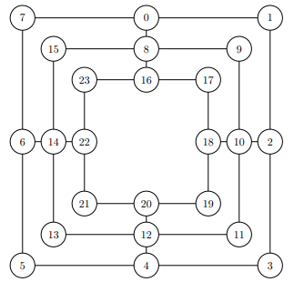

## Introduction

This project originates from the module "Mühle Ki Programmierprojekt" which was offered by the [FMI](https://www.fmi.uni-stuttgart.de/de/) at the University of Stuttgart in 2024.  
It implements the board game "Mühle" or in english "Nine Man Morris" with a simple game ui in pixel art. Furthermore, you can choose to play 1 vs. 1 or against an Ai in different difficulty levels.

**The pixel art was partially provied by [@purpurax](https://github.com/Purpurax) so big thanks for that.**

## Build and Start the Game

To build and start the game you need rust installed on your computer, like specified [here](https://www.rust-lang.org/learn/get-started). Furthermore, you have to download this project and open it and then start the game with:
```
cargo run --release
```

## Implementation

### Game board

The 24 positions of the game board are stored in an u64. One position is stored in 2 bit where 0b11 represents a white token 0b10 a black one and 0b00 and empty position. The two bit positions are from the beginning of the u64 aligned as the image shows



Furthermore, the remaining 16 bits are used to store the current token count of black and white tokens and for each of them the number of possible moves. Because, you need 5 bits each for the possible moves, you only have 3 bits each left for the token count which doesn't fit with max 9 Tokens to store. So the counter only goes for more than 2 tokens which isn't a problem, because 0,1 Tokens are only occurring at the beginning of the game:

000 -> 2 Tokens <br />
001 -> 3 Tokens <br />
... <br />
111 -> 9 Tokens <br />

An example would look like: <br />
0b0010100111011101 00000000001111001110111011001011001110110010001 <br />

0-47: game board <br />
48-50: black token count <br />
51-53: white token count <br />
54-58: black possible moves <br />
59-63: white possible moves 

Disclaimer: This datastructure may seem a bit complicated as well as a few functions in the code. However, this was needed out of efficiency causes to get the maximum depth for the minimax algorithm.

### Minimax

The following pseudocode should give you a first grasp of the minimax algorithm. In my implementation white is the maximizing player
and black the minimizing one. Furthermore, I optimized the pruning by sorting the moves at the beginning of minimax with the static evaluation function. So the most likely best move is searched first in the computation tree.

```
fn minimax(game_board, depth, maximizing_player, alpha, beta) -> score {
    if depth == 0 or game is over
        return evaluate(game_board)

    if maximazingPlayer {
        maxEval = -infinity
        for each forward_board of game_board {
            eval = minimax(forward_board, depth-1, false, alpha, beta)
            maxEval = max(maxEval, eval)

            alpha = max(alpha, eval)
            if beta <= alpha {
                break
            }
        }
        return maxEval
    } else {
        minEval = +infinity
        for each forward_board of game_board {
            eval = minimax(forward_board, depth-1, true, alpha, beta)
            minEval = min(minEval, eval)

            beta = min(beta, eval)
            if beta <= alpha {
                break
            }
        }
        return minEval
    }
}
```
For a better visualization I can recommend this [YT video](https://www.youtube.com/watch?v=l-hh51ncgDI&ab_channel=SebastianLague).

### Heuristic 

The static evaluation function used by minimax is build on a rather simple heuristic. From my testings a simple heuristic with less computation time and therefore greater depth for the minimax performed better than a more complex heuristic with less depth. So the score is evaluated like the following from the token counts and possible moves stored in the game board with more weight on token counts to favor closing mills:

```
fn evaluate(game_board) -> {
    if black wins {
        return -infinity
    } else if white wins {
        return +infinity
    }

    score += (white_token_count - black_token_count) * 20
    score += white_move_count - black_move_count
    return score
}
```
